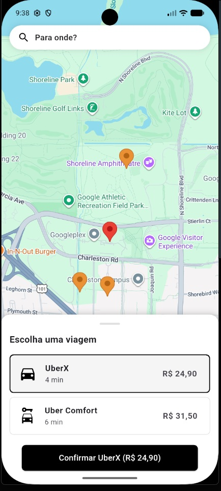

# 🚗 UberClone — Mobilidade Urbana em Flutter


Aplicativo de mobilidade urbana (tipo Uber) desenvolvido em Flutter, construído seguindo os mais altos padrões de arquitetura de software, boas práticas de mercado e integração com os serviços de mapas e geolocalização do Google.

Este projeto foi desenvolvido como peça de portfólio técnico, com o objetivo de demonstrar, na prática, como estruturo aplicações Flutter que consomem APIs externas de geolocalização e mapas em tempo real, seguindo Clean Architecture, injeção de dependência e separação de responsabilidades os mesmos pilares que sustentam aplicações em produção.

## 📱 Preview

<p align="center">
  
</p>

## 🏗️ Arquitetura e Organização

O projeto segue estritamente os princípios de **Clean Architecture**, garantindo alta testabilidade, baixo acoplamento e separação clara de responsabilidades entre as camadas:

```text
lib/
├── core/                  # Theme, DI (injection.dart), utils e services de base
└── features/
    └── map/
        ├── data/           # Datasources, models/DTOs e implementações de serviços (ex: PlacesServiceImpl)
        ├── domain/         # Entidades, enums, contratos de serviço (ex: i_places_service.dart) e usecases
        └── presentation/   # Bloc, páginas, telas e widgets
```

- **Domain (Domínio)**: contém as regras de negócio puras, entidades, contratos de repositórios e serviços de geolocalização (`i_places_service.dart`).
- **Data (Dados)**: implementação concreta dos repositórios e serviços consumindo APIs externas via `Dio`, mapeamento de modelos/DTOs e integração com a Nova Places API do Google (`PlacesServiceImpl`).
- **Presentation (Apresentação)**: telas, componentes visuais e gerenciamento de estado via `Bloc`.
- **Core / DI**: injeção de dependências centralizada utilizando `GetIt` (`injection.dart`), garantindo o desacoplamento na instanciação de serviços.

Cada feature é isolada e independente é possível abrir a pasta de `map`, por exemplo, e compreender a funcionalidade por completo sem depender do restante do projeto.

## 🧠 Decisões Técnicas

Algumas escolhas de arquitetura e os motivos por trás delas:

- **`flutter_bloc` para o fluxo principal do mapa**: estados de busca de destino, cálculo de rota e status da corrida (`TripStatus`) são bem definidos e se beneficiam da previsibilidade e testabilidade do Bloc.
- **`dio` em vez do `http` nativo**: interceptors, cancelamento de requisições e tratamento de erro mais granular, essenciais ao lidar com uma API externa como a Places API (latência, timeout, retries).
- **`get_it` para injeção de dependência**: desacopla a criação de serviços (como `PlacesServiceImpl` e o serviço de rotas) da camada de apresentação, permitindo trocar implementações reais por mocks nos testes sem alterar o código consumidor.
- **Contrato de serviço (`i_places_service.dart`) na camada de domínio**: a camada de domínio não conhece o Google Places nem o Dio — apenas a interface. Isso permite trocar de provedor de mapas/geocodificação no futuro alterando somente a camada de dados.
- **`TripStatus` como enum de domínio**: centraliza os estados possíveis de uma corrida (buscando, confirmada, em andamento, concluída) em um único lugar, evitando strings soltas espalhadas pela UI.

## 📦 Principais Pacotes e Dependências

| Pacote | Finalidade |
|---|---|
| [flutter_bloc](https://pub.dev/packages/flutter_bloc) | Gerenciamento de estado reativo e escalável |
| [dio](https://pub.dev/packages/dio) | Cliente HTTP robusto para comunicação com APIs REST |
| [google_maps_flutter](https://pub.dev/packages/google_maps_flutter) | Renderização nativa de mapas para Android e iOS |
| [get_it](https://pub.dev/packages/get_it) | Localizador de serviços para injeção de dependência (DI) |
| Geolocalização & UI nativa | Tratamento de permissões de GPS e desenho de rotas em tempo real |

Integração com a **Nova Places API** do Google (`places.googleapis.com`) para autocomplete de endereços e cálculo de rotas.

## ⚙️ Configuração e Instalação

### 1. Chaves de API e configurações nativas

O projeto utiliza os serviços do Google Maps e da Nova Places API. A chave de API deve estar devidamente configurada nos seguintes pontos do projeto:

- **Injeção de dependência**: configurada via parâmetro no serviço, em `lib/core/injection.dart`.
- **Android**: declarada em `android/app/src/main/AndroidManifest.xml`:
```xml
<meta-data
    android:name="com.google.android.geo.API_KEY"
    android:value="SUA_CHAVE_DE_API_AQUI" />
```
- **iOS**: configurada em `ios/Runner/AppDelegate.swift`.

> ⚠️ Nunca faça commit da sua chave real de API. Prefira variáveis de ambiente ou arquivos ignorados pelo Git (`.gitignore`) para armazená-la localmente.

### 2. Clone o repositório

```bash
git clone https://github.com/ramonsantospinto/uberclone.git
```

### 3. Instale as dependências e execute

```bash
flutter clean
flutter pub get
flutter run
```

## 🧪 Testes

O projeto foi estruturado com foco em cobertura de testes unitários e de widget nas camadas críticas de negócio e serviços de API, incluindo:

- Testes de serviço (`places_service_impl_test.dart`) — validam a integração com a Places API isoladamente, via mocks.
- Testes de Bloc (`map_bloc_test.dart`) — garantem que os estados e transições do fluxo de mapa se comportam como esperado.
- Testes de página (`map_page_test.dart`) — validam a renderização e interação da UI principal.

Para executar a bateria de testes automatizados:

```bash
flutter test
```

## 💬 Sobre o Projeto

Este repositório foi construído com foco em qualidade de código e decisões arquiteturais consistentes, não como um tutorial ou exercício de estudo, mas como demonstração prática de como estruturo aplicações Flutter que integram APIs de geolocalização e mapas no dia a dia profissional.

Fico à disposição para discutir decisões técnicas, trade-offs de arquitetura ou qualquer ponto do código.

## 📄 Licença

Distribuído sob a licença MIT. Veja [`LICENSE`](LICENSE) para mais detalhes.

## 📬 Contato

**Ramon dos Santos Pinto**

- GitHub: [github.com/ramonsantospinto](https://github.com/ramonsantospinto)
- LinkedIn: *https://www.linkedin.com/in/ramon-santos-1464a6108/*
- Portfólio: *https://ramondeveloper.web.app/*
- E-mail: *ramonsantospinto@gmail.com*
